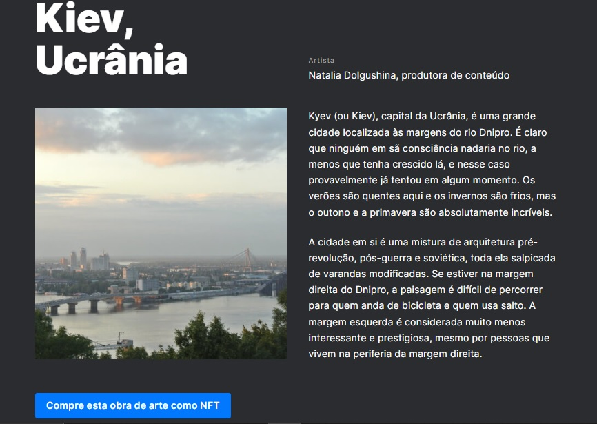
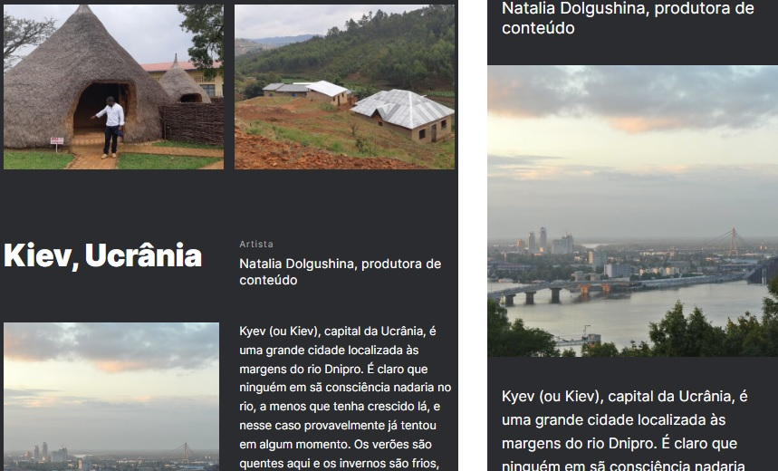

**Projeto**

De Pátria para Pátria

**Descrição**

Este é um projeto que mostra as cidades de origem de alguns funcionários do Practicum. Fizemos isso para que todos os elementos sejam exibidos corretamente em tamanhos de tela populares.  nesse projeto foram usados métodos responsivos baseados nos tamanhos 320px, 768px, e 1280px. Também foi usado a metodologia BEM para a organização dos arquivos CSS.

**Github Page**

Clique no link abaixo para abrir a webpage.

https://brunocarletti182.github.io/web_project_3_ptbr/
